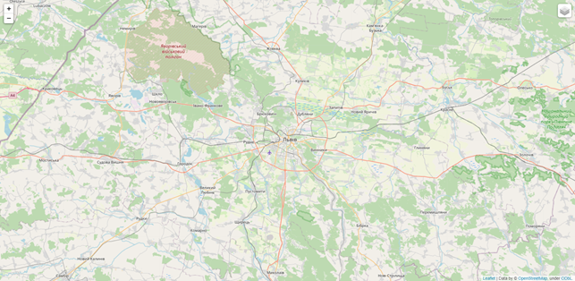
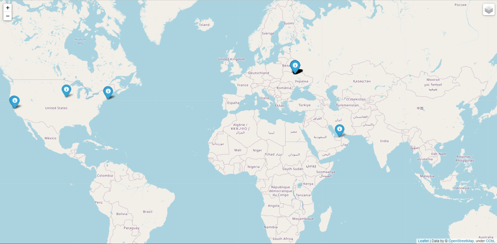

# film_map
This is a Python module for creating map with information about films. It will 
show you the closest 10 locations where film where created in the chosen year. 
Also, this module show you all films created in Chornobyl or Pripyat.

##Information from map
Map created by this module show you 10 movies, which was filmed in chosen year 
closest to you location. It shows you a name of film and year when it was 
created. Also, it shows you all films created in Pripyat or Chornobyl and also 
shows you their name and year of creating.

##Usage
```
#Gets arguments from command line: year latitude longitude path
python main.py 2022 49.83826 24.02324 locations.list
```



##Requirements
folium, argparse and geopy libraries